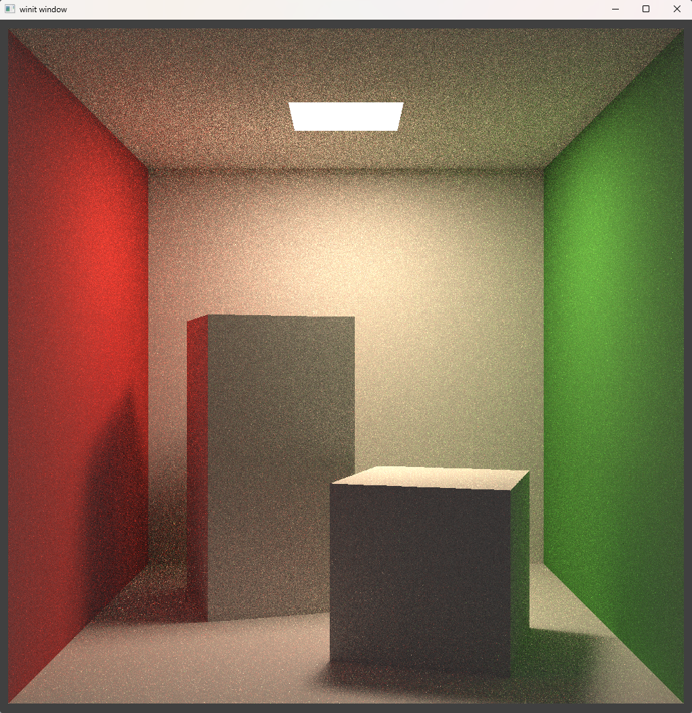

# RVCP Real-time Path Tracer

* A Real-time Path Tracer based on the following
  * Rust
  * Vulkano
  * Compute Shader (Compute Pipeline)
  * PBR Path Tracer (GAMES101 Homework 7)
  
* Demo
  
  * SPP=30, Resolution=384*384
    * 
  
  * SPP=30, Resolution=1024*1024
    * 
  
* Benchmark (Cornell Box)

  * Tested in RTX 3060 12G & Intel i5-12400F
  * | SPP  | Resolution | FPS  |
    | ---- | ---------- | ---- |
    | 10   | 384*384    | 51   |
    | 20   | 384*384    | 25   |
    | 30   | 384*384    | 17   |
    | 10   | 1024*1024  | 7-9  |
    | 30   | 1024*1024  | 3    |

* TODO Lists

  * BVH
  * Important Sampling
  * etc..
