# VulkanLearning

My Vulkan Learning Repo.

The target is to build a real-time ray tracer using ~~vulkan~~ **vulkano**.

## TODO Lists

* 内存的性能测试：修改Shader中struct的内存布局，查看性能是否有提升。

  * 旧的

    ```glsl
    layout(push_constant) uniform Camera {
        vec3 position;
        vec3 up;
        vec3 look_at;
        float t_near;
        float t_far;
        float vertical_fov;
        vec2 size;
    } camera;
    ```

  * 新的

    ```
    layout(push_constant) uniform Camera {
        vec3 position;
        float t_near;
        vec3 up;
        float t_far;
        vec3 look_at;
        float vertical_fov;
        vec2 size;
    } camera;
    ```

  * 理论上，空间开销降低了，因为内存中减少了大量Padding；但是，目前不清楚时间开销是否会降低

* 优化vec2 sample_ray(vec2)

  * 目前是完全按照数学推导写的，存在很大的优化空间
  
* 重构vulkan部分

  * 优化窗口缩放时额外的buffer重建开销
  * 代码整理

* 路径追踪优化

  * 路径重用


## Preview

* Simple Ray Tracing（SPP=10，MaxBounces=50，FPS=1200）
  * 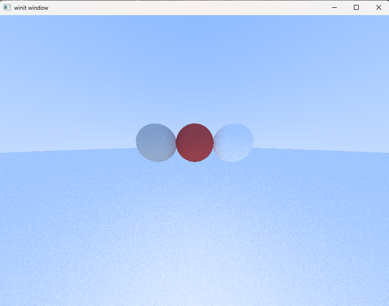

* Fractal (Refer to https://vulkano.rs/05-images/04-mandelbrot.html)
  * 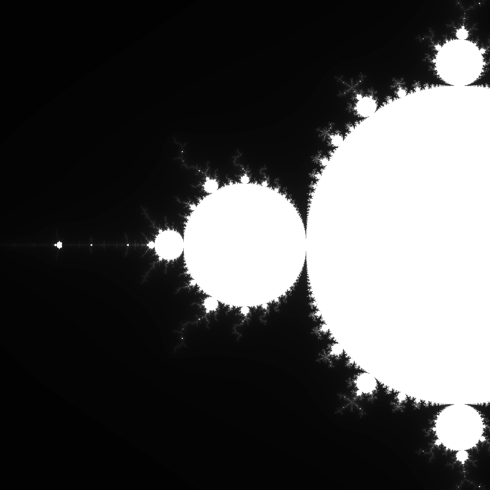

## 笔记：二阶段

* 实现一个基于Compute Shader的Ray Tracing
* 整体框架参考Moer-Lite
  * 材质部分参考Ray Tracing In One Weekend


### 第一步：实现一个能在屏幕上绘制颜色的Compute Shader

* Compute Pipeline vs. Graphics Pipeline
  * 区别蛮大的
* 一个bug，找了两个小时
  * 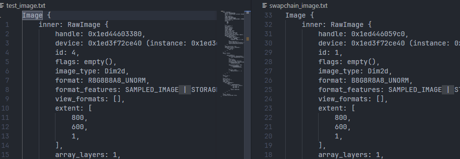
  * **操蛋啊！！！！**
* 搞定

### 第二步：设计Compute Shader光线追踪数据结构

* 按照MoerLite实现
* CPU端
* GPU端
  * 输入Buffer：Shapes、Material、Light
  * 输出Buffer：画布
  * PushConstants
    * 摄像机数据
      * Transform（Position、Up、LookAt）, t_near, t_far, vertical_f........
* 光线追踪流程
  * Camera：相机生成光线（Moer-Lite在一个像素点处进行多次采用，我们这里进行简化，直接根据像素中心点采样）—— 通过PushConstants传递数据，光线生成在shader中硬编码
  * Sampler：采样器 —— 在shader中硬编码
  * Integrator：积分器 —— 在shader中硬编码
  * Shape：几何体 —— 通过Buffer传输
  * Acceleration：加速结构 —— 先不考虑
  * Light：光源 —— 通过Buffer传输
  * Material：材质 —— 通过Buffer传输

### 第三步：往shader中导入数据

* **大坑**：vulkano-shaders会对shader代码进行解析。而entry point只会包含 **编译器优化后的代码中 使用到的变量信息**。也就是说，如果你定义了一些binding point，但是main()函数中不会使用到这些binding point对应的变量，那么你就无法在descriptor point中对其进行绑定！会导致运行时错误！
  * 所以，以后最好先写shader的雏形，再往里导入数据

### 第四步：写光追！

* sample_ray
  * 输入
    * 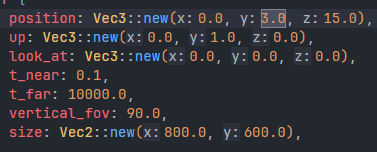
  * 输出 RGB = vec3(direction.x, direction.y, 0.0)
    * 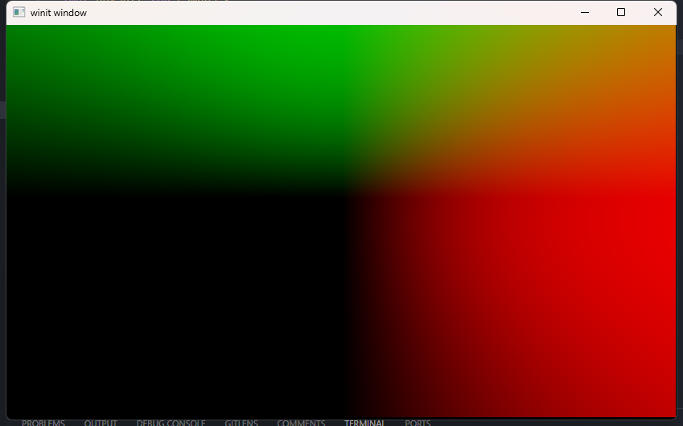
  * 正确的
  
* 无视材质情况下的渲染球体
  * **大坑！**：Vulkan内存对齐，除了struct内存对齐，一个数组的两个相邻变量也要对齐！惊了！
    * push_constants，只需要对齐内部，不需要struct末尾的padding
    * buffer，需要对齐内部和相邻元素，**需要struct末尾的padding**
    * [Vulkan Alignment Requirements 文档](https://vulkan-tutorial.com/resources/vulkan_tutorial_en.pdf#page=183&zoom=100,178,658)
  * 搞定！
    * 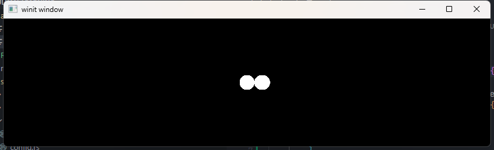
  
* 材质采样

  * 小坑：蒙特卡洛路径追踪，需要随机数。而UNIX时间不能使用float表示，否则末几位会变成0

* 遇到一个奇怪的问题

  * ```glsl
    float g_rand_seed = 19260817.0;
    void srand(float time, vec2 uv) {
        g_rand_seed = fract(sin(time) * 43758.5453 + sin(uv.x) * 22578.5453 + sin(uv.y) * 114514.1919);
    }
    float rand() {
        g_rand_seed = fract(sin(g_rand_seed) * 43758.5453);
        return g_rand_seed;
    }
    vec3 rand3() {
        return vec3(rand(), rand(), rand());
    }
    
    // advanced random
    vec3 random_in_unit_sphere() {
        vec3 p;
        int max_attempts = 100;
        int attempts = 0;
        do {
            p = 2.0 * rand3() - vec3(1.0);
            attempts += 1;
            // if (attempts > max_attempts) {
            //     return vec3(1.0);
            // }
        } while (dot(p, p) >= 1.0);
        return normalize(p);
    }
    ```

  * 上面这段代码，一直执行random_in_unit_sphere()就会崩溃

  * 但是如果把中间关于attemps的if的注释去掉，就不会崩溃

  * 【为什么？】

    * 解决了！
    * 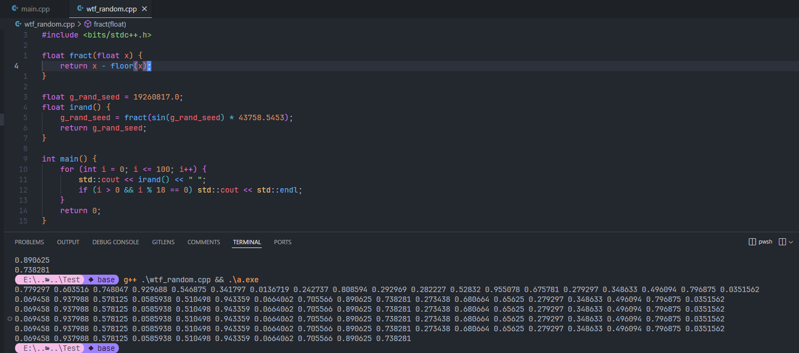
    * 就float有精度限制，是4byte，所以这个随机数，本质上是建立了一系列4byte -> 4byte的映射。而不同的常数，表示了不同的映射。这个常数表示的映射，会让大部分种子，最后陷入一个长度=18的循环节，所以就寄了
  
* GLSL的Reflect问题

  * 入射光
    * 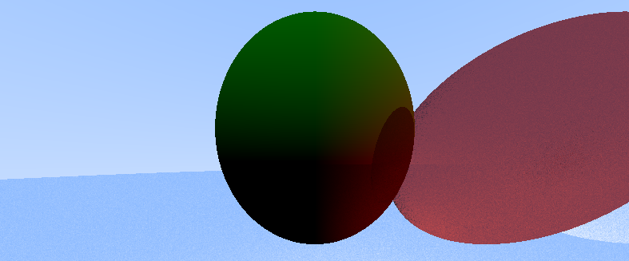

  * 法线
    * 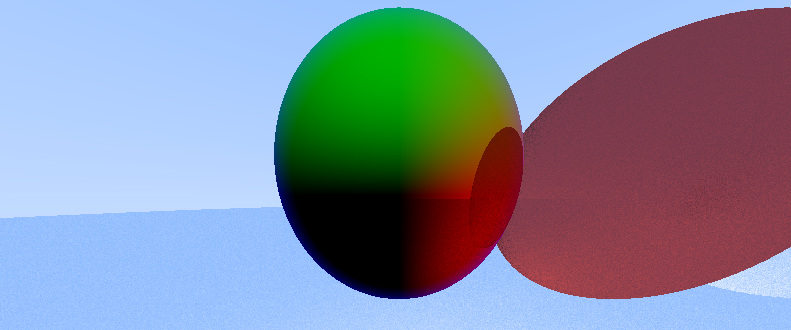

  * 反射（错误图像）
    * 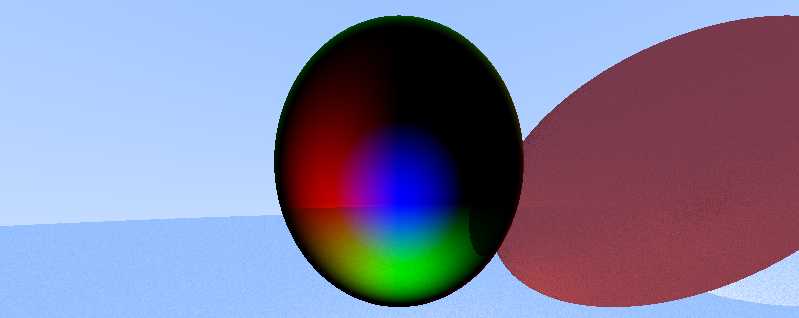

  * ~~在最后一张反射图中：① 边缘是错误的，红色应该在右边，绿色应该在上面；② 但是中心是正确的！蓝色就应该在正前方~~
  * ~~原因：光线打到球面边缘时，是从法线反方向的半球面处射入的，所以反射方向相反；而光线打到球面中心时，是从法线正方形射入的，所以反射方向正确！~~
  * ~~所以，反射光线需要特判，改到normal方向的半球上~~
  * 【为什么？？？】
    * 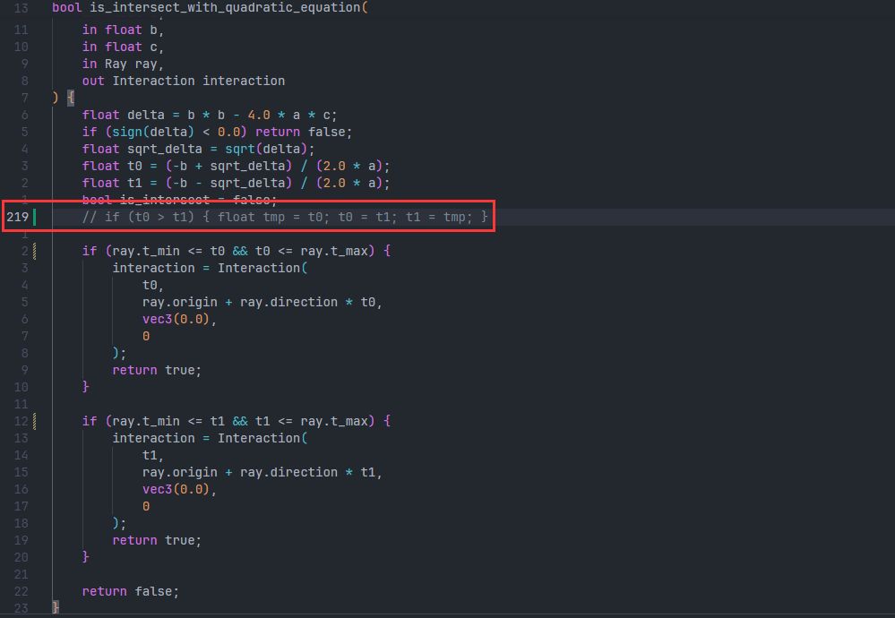
    * 漏了219行
    * 草！太难蚌了！我这段求交代码是从CGPC2024的题目里复制出来的！笑死！
  
* 球体底部法线不正确

  * 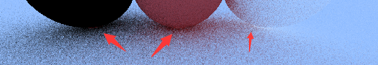
  * 【待解决，不知道为什么】
    * 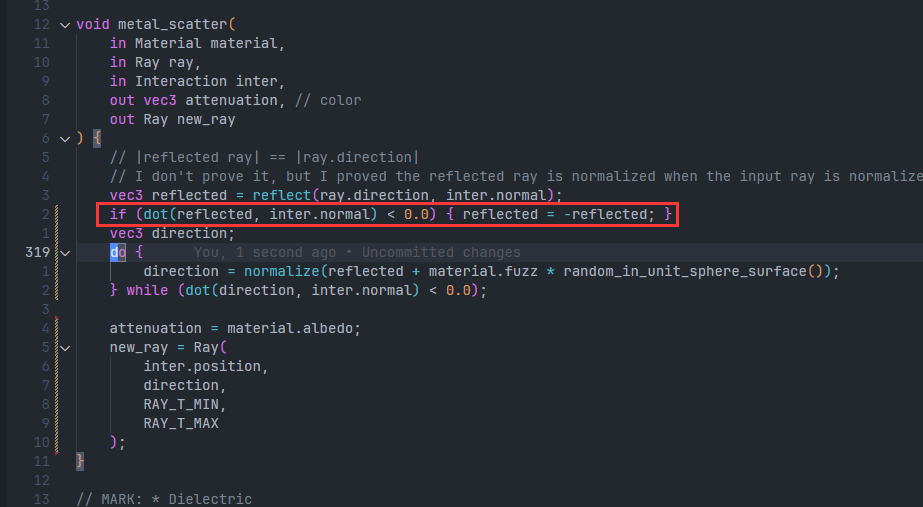
    * 目前通过这个hack，把reflected投影到法线半球

* 重构数据

  * 球 —— Done
  * 三角面片
  * 自动构建 发光球体id的Buffer
  * 自动构建 发光三角面片id的Buffer
  * Done

* 问题：这两种采样是否等价？

  * 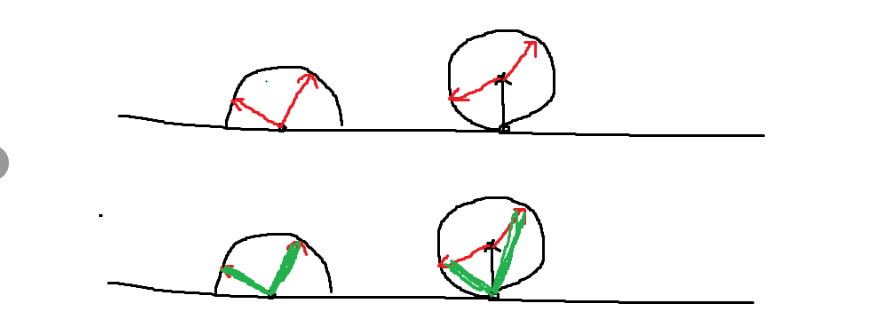
  * 二维情况下，计算了一下，这两个采样感觉是等价的。因为旋转角是一个线性关系（金神提供的思路）
  * 三维情况下，感觉也是等价的。但为什么我跑出来的图，结果不一致呢？
  * 
  * 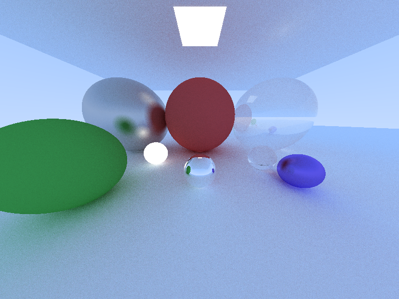
  * 复习一下
    * 单位球面上采样
      * 直接极坐标系采样：不均匀！笛卡尔坐标系上是均匀的，而映射到球面上之后，两极分布会密集很多（是一个不保面积的映射）
        * 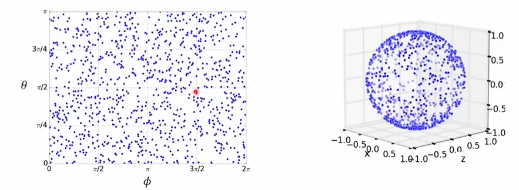
        * 如何修正：通过加权实现，赤道部分多采一些。（下图中的f就是PDF，根据PDF得出权值）
          * 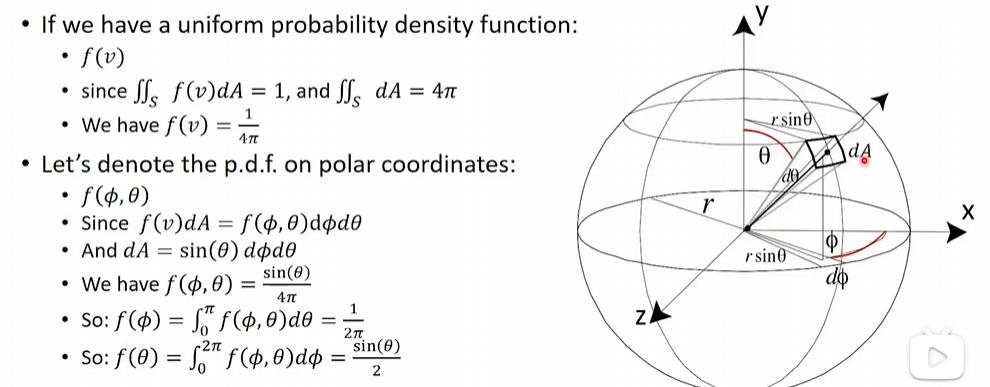
  
        * 结论：
  
      * 拒绝采样法（the rejection method）
  
  * **证明两个采样不等！**
    * **思路：求出单位 $dcos\theta$ 对应的球面面积 $dA$ 即可**
    * 方案B：https://forum.taichi-lang.cn/t/s1-07-importance-sampling/2047/2
    * 方案A：（实际上是方案B的子步骤）
      * 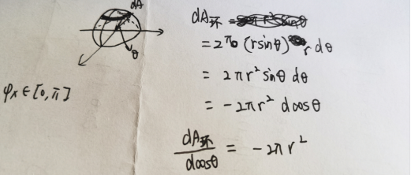
  
    * 和金神讨论了一晚上，第二天早上终于解决了！
  
  * 复习BRDF
    * https://www.cnblogs.com/jerrycg/p/4932031.html
  
* 摄像机移动

*  Debug，修复能量不守恒等各种问题

  * 参考：https://cnblogs.com/jerrycg/p/4924761.html，讲PBR，有公式
  * 为什么我的场景比别人暗？
  * 调了一个晚上。。。原来是别人light亮度 > vec3(1.0)。。。啊啊啊好合理阿！为什么要假设light亮度最大只能为vec3呢？
  * 【光线追踪有好多种写法，我这次参考了Moer-Lite、Ray Tracing In One Weekend（简称RTIOW）、GAMES101的作业7，每个人的写法都不一样。效果最好的RTIOW，但是光线弹射时根本没有考虑cos项。究竟哪种才是真正符合物理的？】


## 笔记

### Queue & QueueFamily

* GPU的队列&队列家族，可以类比成CPU的线程&线程池

* 每个不同的队列家族，会提供不同的操作类型。比如Graphics Queue Family，就提供一组（例如16个）队列，每个队列性质类似，可以执行Graphics相关的命令

* 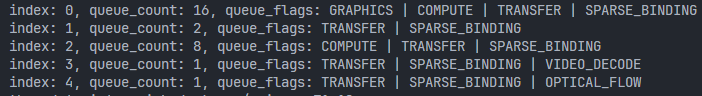

* 小尝试

  * 创建Device的时候，我们要给这个Device分配一个或多个Queue。这个Queue的数量是要预先指定的，否则就可能出现`queues.next().unwrap()`失败的情况

  * ```rust
    let (device, mut queues) = Device::new(
        physical_device,
        DeviceCreateInfo {
            queue_create_infos: vec![QueueCreateInfo {
                queue_family_index,
                queues: vec![0.5, 0.5],
                ..Default::default()
            }],
            ..Default::default()
        }
    ).unwrap();
    let queue = queues.next().unwrap();
    let queue2 = queues.next().unwrap();
    ```

* Queue具体在什么时候使用的呢？

  1. 创建Command Buffer的时候，需要传入该Queue的QueueFamilyIndex
  2. Submit Command的时候，需要传入Queue

* 【发现一个问题：创建CommandBuffer时，使用family index 0，但execute的时候，使用family index 1的一个queue实例。结果竟然是对的】

  * 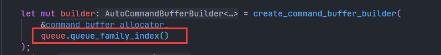
  * 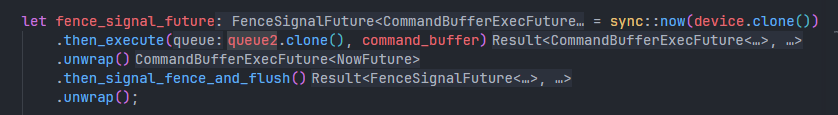

### Buffer

* 合法
  * 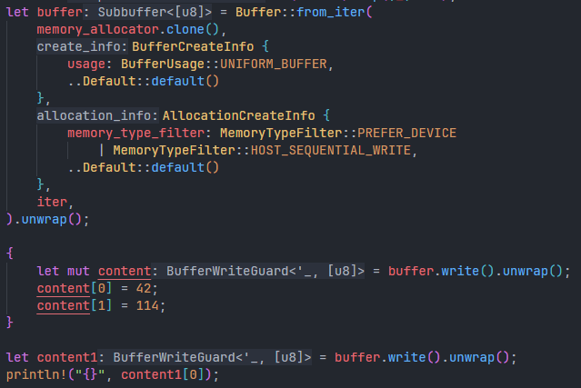
  * 第二个 `buffer.write()` 改成 `buffer.read()`，仍合法
* 不合法
  * 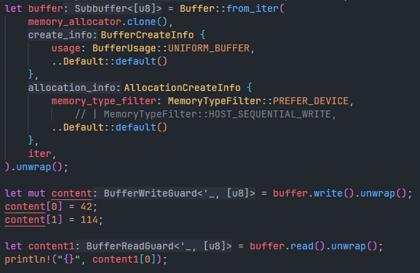
  * 原因有二：① 读写锁冲突；② Memory对CPU不可见

### Command Buffer

* 每个Command Buffer都需要和一个QueueFamily绑定
* 在Submission的时候，一个CommandBuffer才会和具体的Queue绑定

### Pipeline

* 如何创建一个Pipeline？
  * 一个Pipeline依赖于Stages和Layout（其中，Layout也依赖于Stages）
  * Stages包含了Pipeline的阶段信息，比如是否包含vertex shader和fragment shader

### Allocator

* 目前了解到的，总共有3种常见的Allocator，这些Allocator都可以复用，不需要每次新建
  * MemoryAllocator
  * CommandBufferAllocator
  * DescriptorSetAllocator
* Image和Buffer创建时参数的对比
  * Buffer::from_iter() 有4个参数
    * memory allocator、buffer create info、allocation info、initial data
  * Image::new() 有3个参数
    * memory allocator、image create info、allocation info
  * 其中，第1个和第3个参数都是一样的

### Framebuffer

* Framebuffer的创建依赖RenderPass和ImageView
  * 【Framebuffer的attachments信息，是否要和RenderPass的attachments信息一致？】
  * ImageView有两种创建方式
    1. 从Swapchain中获取Image
    2. 自己创建Image

### RenderPass

* 获取Subpass需要从RenderPass中得到
  * 类似Queue和QueueFamily、Layout和SetLayouts的关系

### Swapchain

* Instance依赖Vulkan Library
* Surface依赖Instance和Window（Window需要由winit等库创建）
* Physical Device依赖于Instance选择（从Instance访问机器上所有GPU）
* Device依赖Physical Device中取出的Queue Family Index
* 最后，Swapchain依赖Device和Surface


