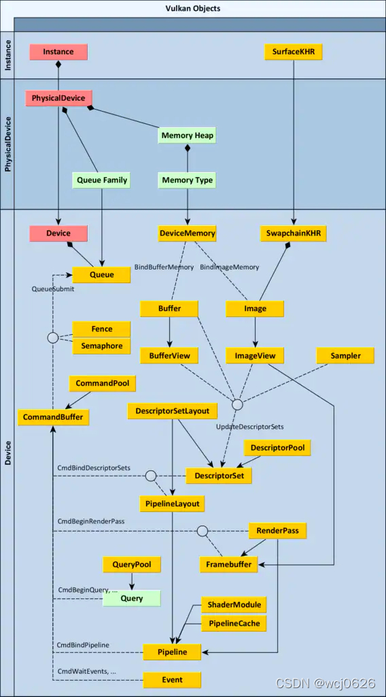

# Vulkan Data Structure Summary

## 1. 数据结构

### 1.1 实例与设备层级

- **GLFWwindow***: 与平台无关的窗口句柄，用于与Vulkan交互并显示结果。
- **VkInstance**: Vulkan库的实例，表示Vulkan驱动的状态和功能。
- **VkPhysicalDevice**: 表示一个具体的物理GPU，用于查询设备能力。
- **VkDevice**: 代表了与物理设备的逻辑连接，用于创建和管理资源。

### 1.2 调试与错误处理

- **VkDebugUtilsMessengerEXT**: 提供调试信息的回调接口，用于日志记录和错误处理。

### 1.3 表面与交换链

- **VkSurfaceKHR**: 一个抽象层，代表用于显示输出的表面。
- **VkSwapchainKHR**: 管理图形交换链，用于图像的呈现。

### 1.4 图像处理

- **VkImage**: 表示图像资源，如纹理和帧缓冲。
- **VkImageView**: 为图像资源提供了一个视图，定义如何访问图像和图像的具体部分。
- **VkRenderPass**: 定义一系列的图像处理操作，如何处理帧缓冲区的内容。

### 1.5 命令与缓冲

- **VkCommandPool**: 管理命令缓冲区的内存，所有命令缓冲都从这里分配。
- **VkCommandBuffer**: 存储待执行的命令序列。

### 1.6 描述符

- **VkDescriptorSetLayout**: 定义了一组描述符的布局，用于着色器访问资源。
- **VkDescriptorPool**: 用于创建描述符集，管理描述符内存的分配。
- **VkDescriptorSet**: 包含着色器使用的实际资源引用。

### 1.7 管道

- **VkPipelineLayout**: 定义了着色器阶段使用的资源布局。
- **VkPipeline**: 封装了图形或计算管道的全部状态，包括着色器，绑定布局等。

### 1.8 同步原语

- **VkSemaphore**: 用于队列间和命令缓冲区之间的同步。
- **VkFence**: 用于CPU和GPU之间的同步，可阻塞CPU执行直到GPU操作完成。

### 1.9 存储与缓冲

- **VkBuffer**: 用于存储顶点数据，索引数据，统一缓冲区等。
- **VkDeviceMemory**: 为Vulkan资源分配的设备侧内存。

### 1.10 队列

- **VkQueue**: 表示设备的执行队列，用于提交执行命令。

## 2. 相互关系

* 参考：https://blog.csdn.net/wcj0626/article/details/123345570
* 